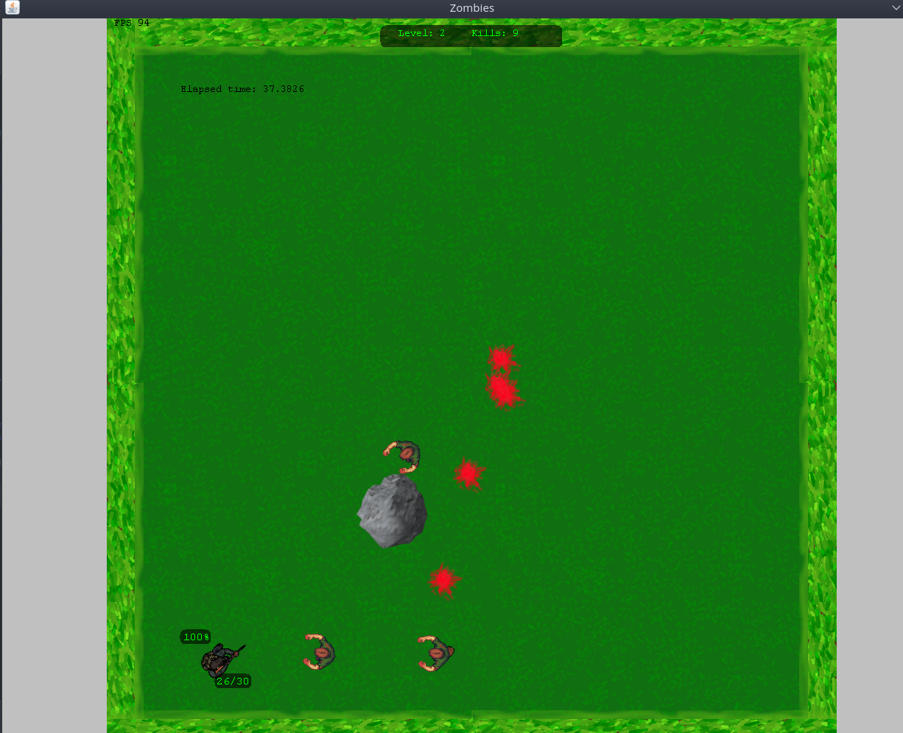

# ZombieGame
A basic rendering of sprites in Java from CSCI-2510 Intro to Game design that I took further  

  

  
Excerpt from the design doc (located in the root directory):  
  
For this project, I created an endless zombie game. The goal is to eliminate all zombies on the screen by shooting them. The player is moved by WASD, shoots with a left click, reloads with R, changes weapons with the scroll wheel, and rotates by always facing the position of the mouse pointer. 
  
The world space is encased by some grass wall boundaries that the player, bullets, and zombies cannot cross. There exists one rock (in this implementation, otherwise can be changed with numRocks variable in code to create more) that is spawned in random locations. Zombies, bullets, and the player cannot move through the rock. The rock can be moved by right clicking with the mouse once and dropped with another right click. 
  
I originally wanted to create some sort of base building technique with this feature, but that would take more time.  (You can hold the rock suspended by the mouse position and exploit the fact that zombies can’t cross through it.)
  
The game progresses by eliminating every zombie in each level. After completing a level, the game resets the player position, rock position, weapon status (ammo), and zombies. Each level adds four times as many zombies as the one before. The player will lose 25 health per hit taken by zombie. Once the player’s health is depleted, the game resets from the first level. There is no end to this, so if the player gets far enough, the performance begins to suffer from massive zombie creation in the beginning of each level. 
